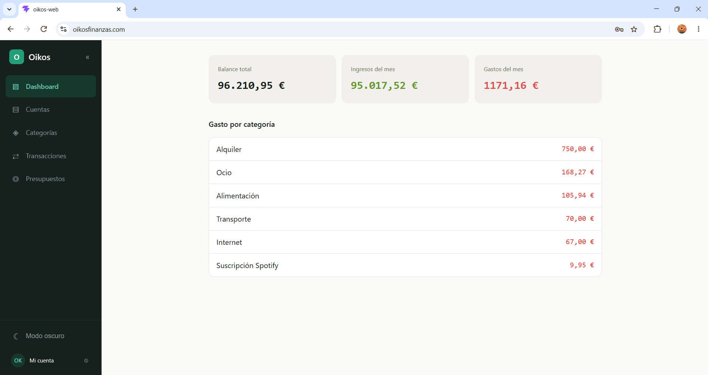
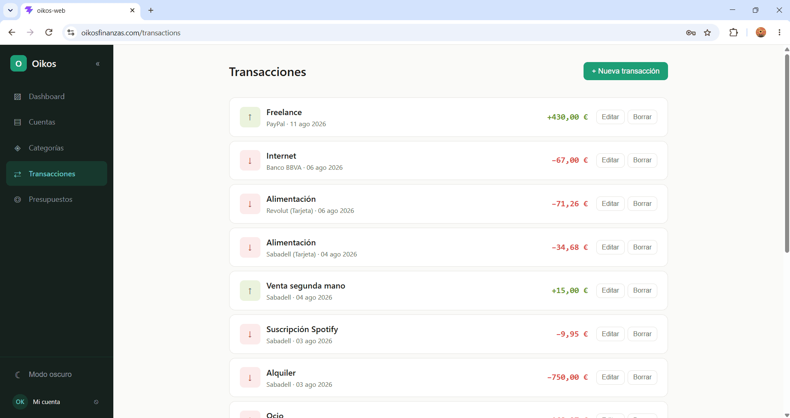
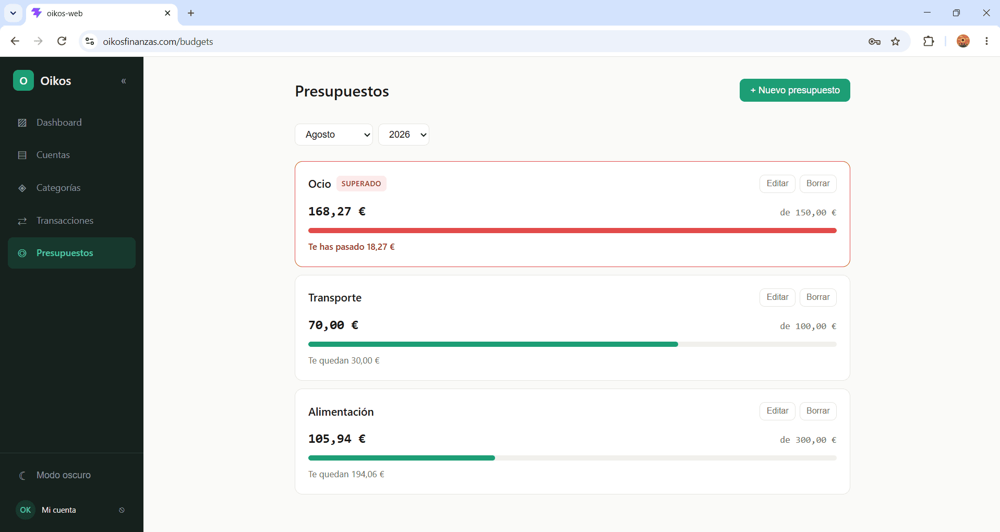
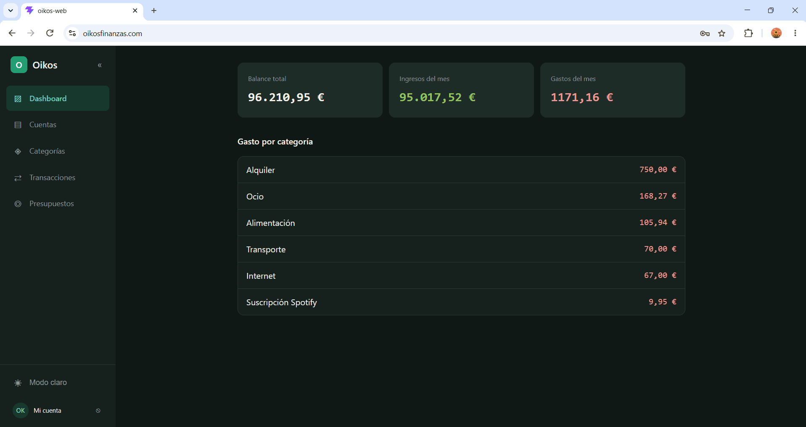
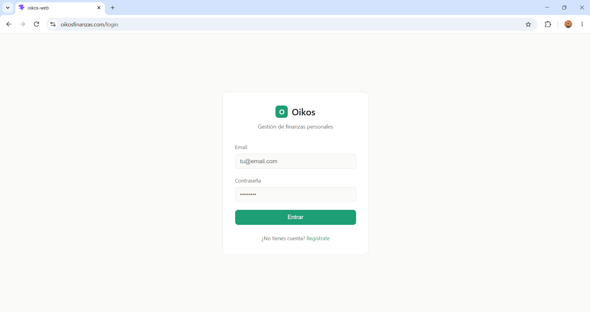
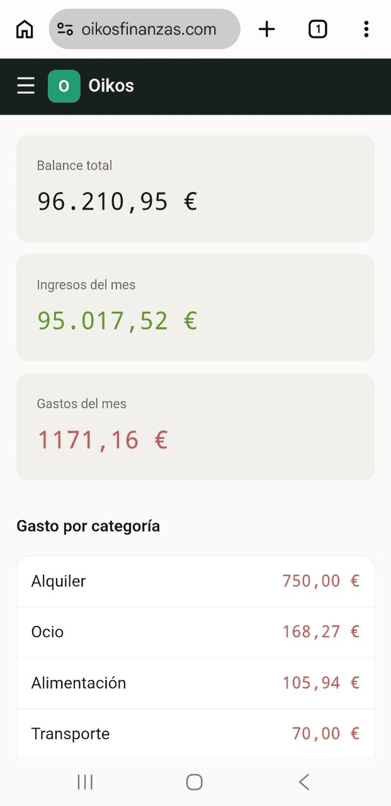
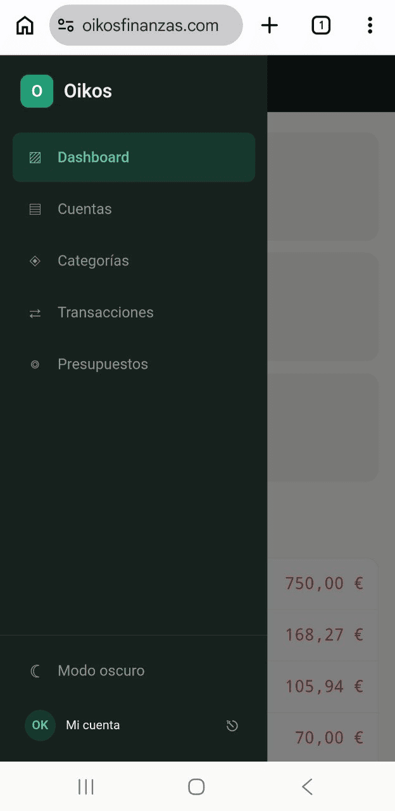
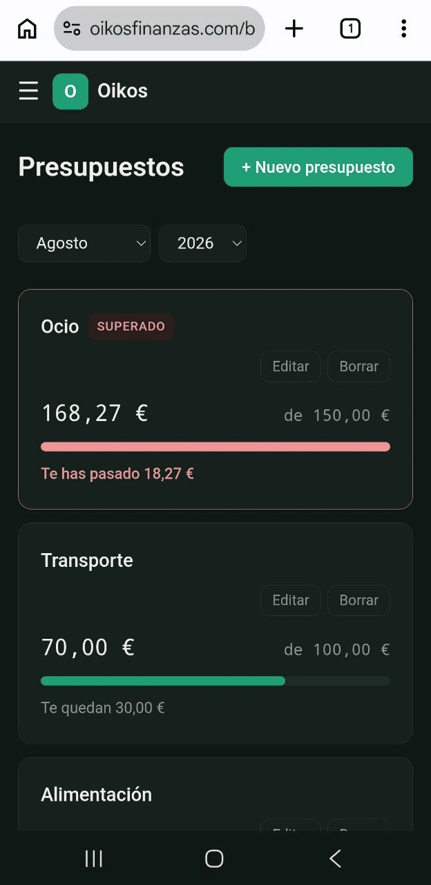

<div align="center">

# Oikos

**Aplicación de finanzas personales multiplataforma**

Un backend único que sirve datos a clientes de web, móvil y escritorio. Gestiona cuentas, categorías, transacciones y presupuestos, con saldos y alertas calculados en tiempo real.

### 🌐 Pruébala en vivo → **[oikosfinanzas.com](https://oikosfinanzas.com)**

📖 Documentación de la API → **[Swagger](https://oikosfinanzas.com/swagger-ui/index.html)**



</div>

---

> [!NOTE]
> **Proyecto de demostración.** Oikos es un proyecto personal de aprendizaje y portfolio. La aplicación está disponible públicamente para poder probarla, pero **no debe usarse con datos financieros reales**. Consulta el [aviso legal](#aviso-legal) más abajo.

---

## Sobre el proyecto

El nombre viene del griego *oîkos* (οἶκος), «hogar» o «administración del hogar», raíz de la palabra *economía*.

Oikos nace de una idea sencilla: tener las finanzas personales sincronizadas en cualquier dispositivo, con un backend propio como única fuente de verdad. La lógica de negocio vive centralizada en la API, y los clientes son consumidores ligeros que comparten los mismos datos.

Un principio de diseño recorre todo el proyecto: **los datos derivados no se almacenan, se calculan**. El saldo de una cuenta, por ejemplo, nunca se guarda como un campo; se obtiene sumando sus transacciones en el momento de consultarlo. Esto garantiza que el saldo siempre sea coherente con los movimientos reales, sin riesgo de desincronización.

---

## Funcionalidades

- **Autenticación y autorización** con JWT (registro, login, tokens firmados) y contraseñas con BCrypt.
- **Cuentas** (efectivo, banco, tarjeta) con saldo calculado dinámicamente a partir de las transacciones.
- **Categorías** de ingreso y gasto, con color personalizable.
- **Transacciones** con relaciones a cuenta y categoría, importes con precisión monetaria exacta y filtrado por tipo.
- **Presupuestos** por categoría y mes, con barra de progreso y alerta visual al superar el límite. El gasto real se calcula sumando las transacciones del periodo.
- **Panel de resumen** con balance total, ingresos y gastos del mes, y desglose de gasto por categoría (agregación en base de datos).
- **Autorización a nivel de recurso**: cada usuario solo accede a sus propios datos, garantizado en la capa de consulta.
- **Modo claro y oscuro** con preferencia persistente.
- **Diseño responsive**, funcional en escritorio y móvil.

---

## Capturas

### Escritorio

| Dashboard | Transacciones |
|-----------|---------------|
|  |  |

| Presupuestos | Modo oscuro |
|--------------|-------------|
|  |  |

<div align="center">



</div>

### Móvil

<div align="center">

  

</div>

---

## Stack tecnológico

### Backend
| Capa | Tecnología |
|------|------------|
| Lenguaje | Java 17 |
| Framework | Spring Boot 4 (Web, Data JPA, Security, Validation) |
| Base de datos | PostgreSQL 17 |
| Autenticación | JSON Web Tokens (JJWT) + BCrypt |
| Documentación | OpenAPI / Swagger (springdoc) |
| Contenedores | Docker / Docker Compose |
| Build | Maven (con wrapper) |

### Frontend
| Capa | Tecnología |
|------|------------|
| Framework | React 19 + TypeScript |
| Build | Vite |
| Enrutado | React Router |
| Peticiones HTTP | Axios (con interceptor para el JWT) |
| Estilos | CSS con design tokens (sistema de diseño propio) |

### Infraestructura
| Elemento | Detalle |
|----------|---------|
| Servidor | VPS (Ubuntu 24.04) |
| Reverse proxy | Caddy (HTTPS automático con Let's Encrypt) |
| Servicio | systemd |
| Dominio | oikosfinanzas.com |

---

## Arquitectura

Monorepo con backend y frontend en un único repositorio:

```
oikos/
├── backend/     API REST en Spring Boot
├── web/         Cliente web en React + TypeScript
└── docs/        Documentación y capturas
```

El backend sigue una organización **por dominios**, y dentro de cada dominio una separación por capas (Controller → Service → Repository → Entity), con DTOs separados de las entidades para no exponer datos internos.

### Modelo de datos

```
User (1) ──< (N) Account
User (1) ──< (N) Category
User (1) ──< (N) Transaction
User (1) ──< (N) Budget

Account  (1) ──< (N) Transaction
Category (1) ──< (N) Transaction
Category (1) ──< (N) Budget
```

Cada entidad de negocio pertenece a un usuario. Una transacción conecta una cuenta y una categoría; su importe se almacena siempre en positivo, y el tipo (ingreso o gasto) determina si suma o resta al saldo. Los saldos negativos —deudas o números rojos— emergen de forma natural del cálculo `ingresos − gastos`.

### Decisiones técnicas destacadas

- **Saldos y alertas calculados, no almacenados.** El saldo de una cuenta y el gasto de un presupuesto se derivan de las transacciones mediante consultas de agregación (`SUM`, `GROUP BY`), garantizando coherencia.
- **`BigDecimal` para el dinero**, nunca `double` o `float`, evitando errores de redondeo.
- **Autorización a nivel de recurso.** Las consultas incluyen al usuario propietario, de forma que es imposible acceder a datos ajenos aunque se conozca su identificador.
- **Fechas en UTC** en el backend (`Instant`/`LocalDate` según el significado), delegando la conversión a hora local en el cliente.
- **Autenticación stateless** con JWT, sin sesiones en servidor.

---

## Puesta en marcha (local)

### Requisitos
- Java 17 o superior
- Docker Desktop
- Node.js 18 o superior

No es necesario instalar PostgreSQL ni Maven por separado: la base de datos corre en un contenedor y Maven se ejecuta mediante el wrapper incluido.

### 1. Clonar el repositorio

```bash
git clone https://github.com/Mavegari/oikos.git
cd oikos
```

### 2. Backend

```bash
cd backend
cp .env.example .env        # y rellena las credenciales
docker compose up -d        # levanta PostgreSQL
./mvnw spring-boot:run      # en Windows: .\mvnw.cmd spring-boot:run
```

La API queda disponible en `http://localhost:8080` y la documentación en `http://localhost:8080/swagger-ui/index.html`.

Para generar una clave JWT segura:
```bash
openssl rand -base64 32
```

### 3. Frontend

```bash
cd web
cp .env.example .env        # VITE_API_URL=http://localhost:8080
npm install
npm run dev
```

La web queda disponible en `http://localhost:5173`.

---

## Uso de la API

Todos los endpoints, salvo el registro y el login, requieren un token JWT en la cabecera `Authorization: Bearer <token>`.

| Método | Ruta | Descripción |
|--------|------|-------------|
| `POST` | `/api/auth/register` | Registrar un usuario |
| `POST` | `/api/auth/login` | Iniciar sesión y obtener el token |
| `GET`, `POST` | `/api/accounts` | Cuentas |
| `GET`, `POST` | `/api/categories` | Categorías |
| `GET`, `POST` | `/api/transactions` | Transacciones |
| `GET`, `POST` | `/api/budgets` | Presupuestos |
| `GET` | `/api/dashboard/summary` | Resumen financiero |

La documentación interactiva completa está en [Swagger](https://oikosfinanzas.com/swagger-ui/index.html).

---

## Roadmap

Oikos es un proyecto en desarrollo activo. Próximas funcionalidades previstas:

**Producto (v2)**
- Saldo inicial al crear una cuenta (indicar el dinero existente al empezar a usar la app).
- Cuentas que combinan varios productos de una misma entidad (p. ej. banco y tarjeta), y distinción del tipo en los selectores.
- Transferencias entre cuentas (movimientos ligados entre efectivo y bancos).
- Gestión de deudas y préstamos.
- Gastos recurrentes (hipoteca, seguros, suscripciones) con periodicidad configurable.
- Presupuestos recurrentes.
- Inversiones con histórico de valoraciones y cálculo de rentabilidad.
- Panel avanzado con gráficas (evolución mensual, ingresos vs gastos, desglose por categoría) y filtros.
- Verificación de email en el registro.

**Multiplataforma**
- Cliente móvil nativo (Kotlin / Jetpack Compose).
- Cliente de escritorio (Compose Multiplatform).

Todos los clientes compartirán el mismo sistema de diseño (design tokens) para una identidad visual coherente entre plataformas.

---

## Aviso legal y protección de datos

Oikos es un **proyecto personal sin ánimo de lucro, con fines exclusivamente de aprendizaje y demostración (portfolio)**. No es un servicio comercial ni una herramienta financiera real. Al acceder a la versión pública en [oikosfinanzas.com](https://oikosfinanzas.com), aceptas lo siguiente:

- La aplicación se ofrece **«tal cual» (*as is*), sin garantías** de ningún tipo sobre disponibilidad, funcionamiento, seguridad o conservación de datos.
- **Utiliza únicamente datos de prueba ficticios.** No introduzcas datos financieros, bancarios ni personales reales, ni información de terceros.
- Los **usuarios registrados y sus datos se eliminan periódicamente** sin previo aviso. No uses la aplicación para almacenar información que necesites conservar.
- El único dato personal que se solicita es una **dirección de correo electrónico** para el registro. Se recomienda usar un correo ficticio o de prueba. Las contraseñas se almacenan cifradas (BCrypt) y la comunicación viaja sobre HTTPS.
- El autor **no se hace responsable** de ningún daño, pérdida o perjuicio derivado del uso de la aplicación, ni garantiza que esté libre de errores.
- Este proyecto **no está destinado a la gestión financiera real** y no sustituye a ninguna herramienta bancaria o profesional.

Si en algún momento quieres que se elimine tu cuenta o tienes cualquier consulta sobre los datos, puedes solicitarlo a través del [repositorio en GitHub](https://github.com/Mavegari/oikos).

> **Nota:** Este descargo de responsabilidad es un texto orientativo propio de un proyecto de demostración y no constituye asesoramiento jurídico. Si Oikos pasara a ser un servicio real con usuarios efectivos, sería necesario redactar una política de privacidad conforme al RGPD con asesoramiento profesional.

---

## Licencia

Proyecto personal con fines de aprendizaje y portfolio.